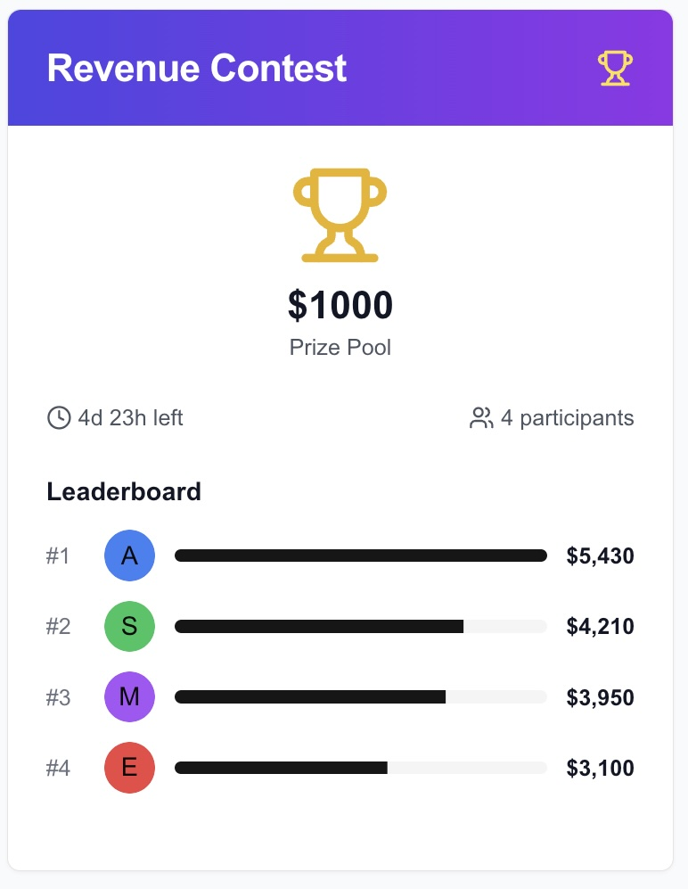

# CartBrawl
## Shopify competitions app.

Creators will set a cash prize (whop balance) for users to compete in a whop to see who's Shopify store can get the most sales in a given time period.

# PRD:
Full giveaways app scope:
1. Creator
	a. Create new giveaway
	b. Set start/end date
	c. Set prize
	d. Launch giveaway
	e. Deposit funds from whop balance
2. User
	a. View giveaway
	b. Click enter
	c. See time remaining
	d. See # of participants
	e. See if you won/lost
3. Notifications
	a. Giveaway upcoming
	b. Giveaway live
	c. You won/lost
4. States
	a. Empty state
	b. Upcoming competition
	c. Active competition
	d. Completed competition

NOTE: App must be simple i/ux